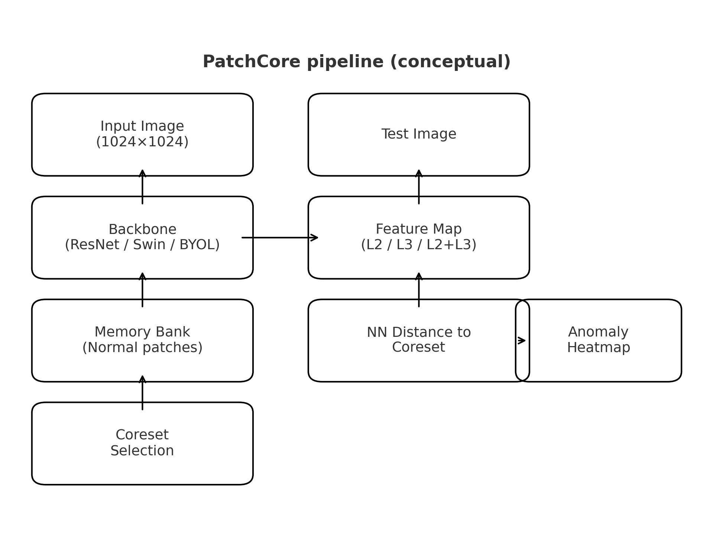
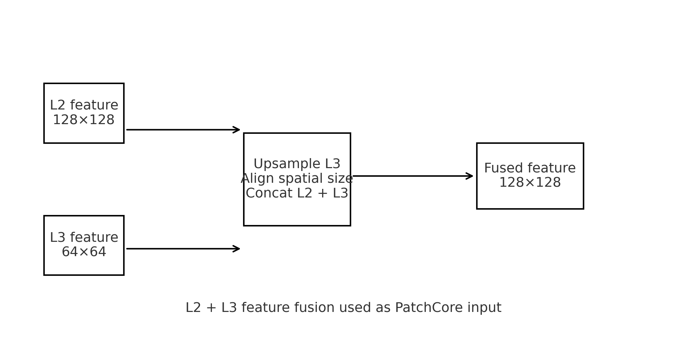
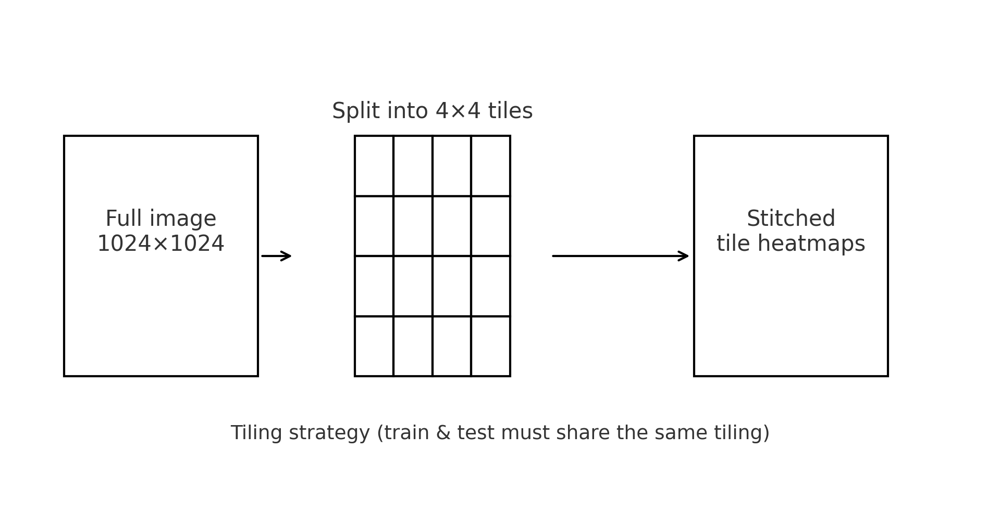
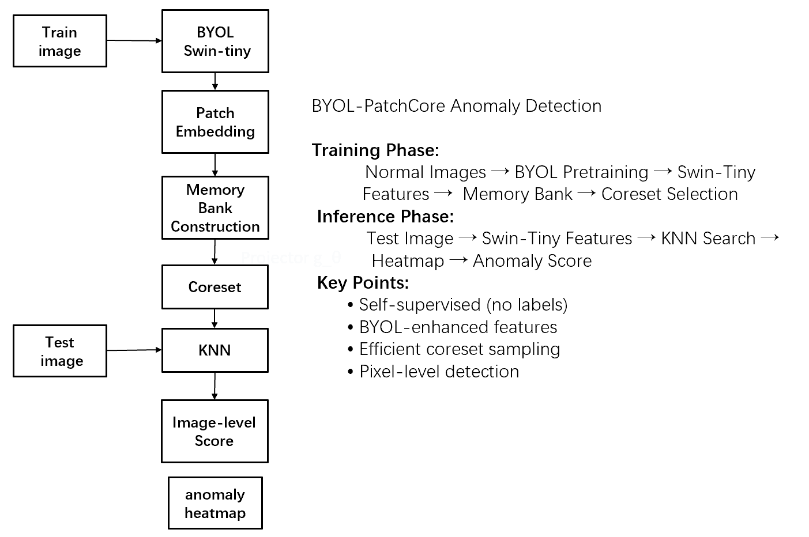
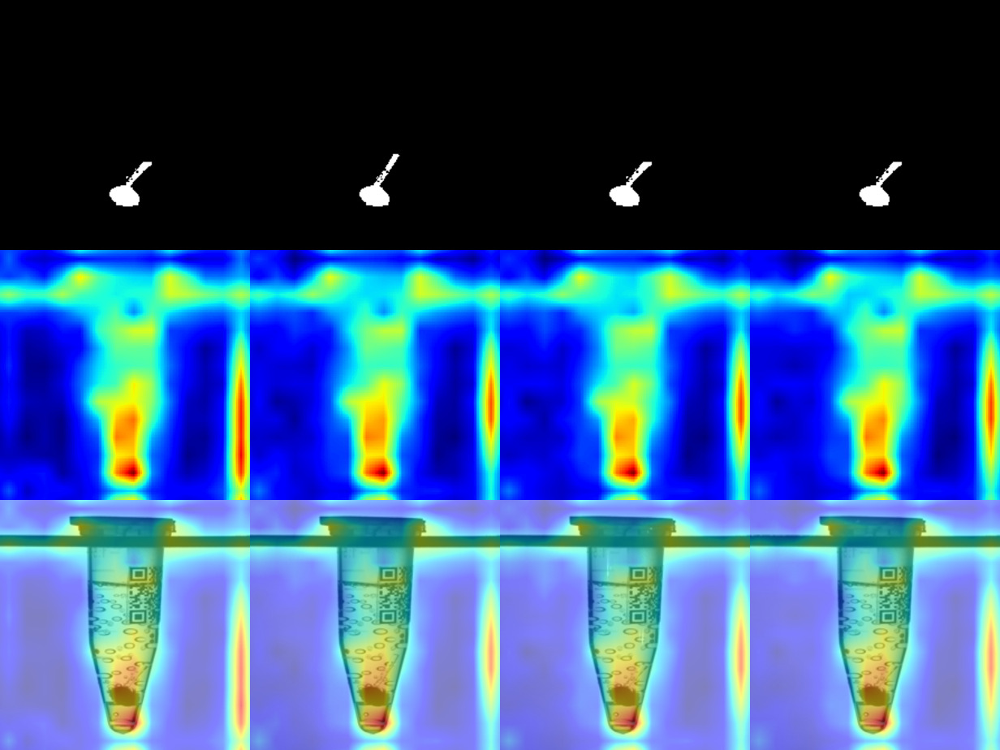
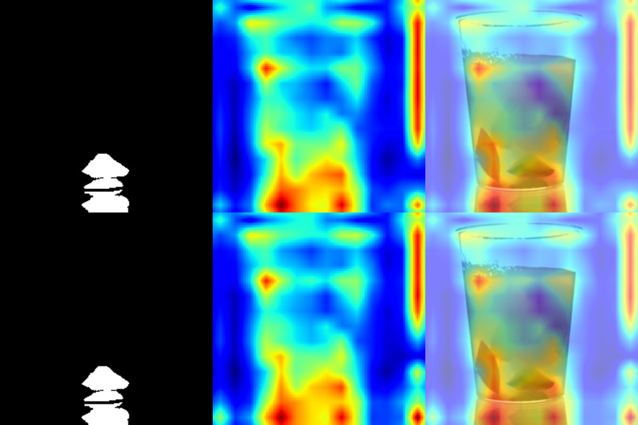

# PatchCore on MVTec AD 2

Investigating why PatchCore fails on the MVTec AD 2 benchmark and proposing simple modifications that close most of the pixel-level segmentation gap.

> Course project for **IMT4392 — Deep Learning** at NTNU.
> Author: **Yayang Qian** ([report PDF](report/IMT4392_Deep_Learning_Report_Yayang_Qian.pdf))

<p align="center">
  
</p>

---

## Summary

State-of-the-art unsupervised anomaly detection methods like PatchCore are near-saturated on the original MVTec AD, but collapse on the harder MVTec AD 2 — particularly on pixel-level localization (AU-PRO). This project diagnoses *why* and proposes fixes.

**Key result.** Multi-scale feature fusion (ResNet50 layer 2 + layer 3) raises **mean AU-PRO@5% from 8.87% to 76.35%** on MVTec AD 2, with category-level gains such as *fruit_jelly* 41.3% → 90.7% and *vial* 46.0% → 91.2%.

### Contributions

1. **Tiling is not the cure.** I reimplemented PatchCore's official **overlapping sliding-window tiling** (224×224 tiles, 112-pixel stride, 50% overlap, weighted Gaussian merging — yielding 40+ overlapping crops per 1024×1024 image). After also fixing a train/test distribution bug introduced by tiling only at inference, AU-PRO@5% moved only from 8.9% → 9.0%. Increasing input resolution alone does not fix segmentation — the bottleneck is elsewhere.
2. **Feature granularity is the actual bottleneck.** Layer3-only features give strong I-AUROC but coarse anomaly maps (AU-PRO ≈ 9%); layer2-only improves localization but increases benign-texture false alarms. **Channel-wise concatenation of layer2 + layer3** (each PCA-reduced to 384, concatenated to a 768-dim descriptor, with layer3 bilinearly upsampled to layer2's grid) is the main driver of the 76.35% AU-PRO result.
3. **I-AUROC vs AU-PRO trade-off.** Multi-scale fusion drops mean I-AUROC from ~90% (layer3-only) to ~66% — layer2 features are more sensitive to benign texture variation. A hybrid scoring scheme (layer3-only for image-level, fused for pixel-level) is proposed as future work.
4. **Swin-T pitfall identified.** Naively applying Global Average Pooling to Swin-T's token map collapses spatial information and reduces PatchCore to an image-level detector (mean AU-PRO ≈ 51%). The fix — preserve the full token grid — was identified and qualitatively validated; full re-benchmarking is left to future work.
5. **BYOL self-supervised pretraining cannot rescue the GAP bug.** Under the broken integration, supervised vs BYOL Swin-T differ by < 1% AU-PRO. No pretraining strategy compensates for losing spatial structure.
6. **Memory bank size and selection are not the bottleneck.** Larger coreset (3000) and a k-means + greedy hybrid both performed slightly *worse* than the default 2000-greedy on Model D's exact pipeline (69.23% / 67.58% vs 76.35% AU-PRO). The contribution is in the feature domain, not memory bank design.

See [`report/IMT4392_Deep_Learning_Report_Yayang_Qian.pdf`](report/IMT4392_Deep_Learning_Report_Yayang_Qian.pdf) for full methodology, ablations, and qualitative results.

---

## Method

### Multi-scale feature fusion

<p align="center">
  
</p>

For each spatial location, layer2 and layer3 feature descriptors are individually PCA-reduced (d = 384) then channel-wise concatenated, after bilinearly upsampling layer3 to layer2's grid. The fused 768-dimensional descriptors are coreset-sampled (greedy k-center) into a memory bank for nearest-neighbor anomaly scoring.

### Why tiling does not help

<p align="center">
  
</p>

The figure above is for visualization; the actual implementation follows PatchCore's official overlapping sliding-window tiling. Even with correct overlap and weighted merging, AU-PRO improves only marginally (8.9% → 9.0%) because tiling refines *input* resolution but leaves *feature* resolution unchanged — patches still come from layer3, whose receptive field is too large for subtle defects.

### Swin-T + BYOL exploration (negative result)

<p align="center">
  
</p>

The supervised and BYOL-pretrained Swin-T variants both produced near-random localization (AU-PRO ≈ 50%) under a Global Average Pooling integration that collapsed spatial information. The fix — flatten the token grid analogously to a CNN feature map — was identified and qualitatively verified; a full re-benchmark is left to future work.

---

## Results

> **Metric notation.** **I-AUROC** = image-level ROC-AUC. **P-AUROC** = pixel-level ROC-AUC (diagnostic only — can be misleadingly high). **AU-PRO@5%** = Area under the per-region overlap curve, integrated up to 5% FPR — this is the official AD 2 segmentation metric and the primary metric throughout. **SegF1** = thresholded segmentation F1 (sensitive to a single threshold; reported only for ablation completeness).

### Overall comparison on MVTec AD 2

| Model ID         | Backbone & setting                    | I-AUROC | P-AUROC | AU-PRO@5% | SegF1  |
|------------------|---------------------------------------|--------:|--------:|----------:|-------:|
| WR50-baseline ¹  | WR50, layer2, default coreset         |  0.704  |  0.857  |    38.49  | 20.37  |
| Model A ²        | R18, layer2, coreset 2000             |  0.609  |  0.000  |    57.81  |  0.00  |
| Model B          | R18, layer3, coreset 1000             |  0.675  |  0.500  |    64.04  | 42.50  |
| Model C ²        | R50, L2+L3, *approximate* metric      |  0.639  |  0.500  |     0.00  |  0.00  |
| **Model D (ours)** | **R50, L2+L3, exact metric, 50k pool** | **0.659** | **0.763** | **76.35** | **9.58** |
| Model E          | R50, L2+L3, coreset 3000              |  0.582  |  0.692  |    69.23  |  5.15  |
| Model F          | R50, L2+L3, **k-means + greedy**      |  0.593  |  0.675  |    67.58  |  3.77  |
| Swin-T ³         | Swin-T (broken GAP integration)       |  0.476  |  0.509  |    50.95  |  1.79  |
| Swin-T + BYOL ³  | + BYOL pretrain (broken GAP)          |  0.506  |  0.502  |    50.25  |  1.83  |

¹ **WR50-baseline (38.49%) is an internal reference for Models A–F only.** It is *not* the same as the single-layer 8.9% baseline used in the tiling narrative — that one is ResNet50 layer3-only on resized 224×224 inputs.
² **Models A and C show degenerate values** (P-AUROC = 0 / AU-PRO = 0). Model A's R18-layer2 produces extremely low-variance descriptors collapsing the patch-distance distribution; Model C uses an approximate AU-PRO routine that returned an all-zero anomaly map. Retained for ablation completeness; not real model failures.
³ Swin-T rows reflect the broken GAP integration described in the methodology — included as a cautionary illustration, not a fair comparison.

### Per-category breakdown — best model (Model D, ResNet50 L2+L3)

| Category    | I-AUROC | P-AUROC | AU-PRO@5% |
|-------------|--------:|--------:|----------:|
| Fruit Jelly |  0.783  |  0.907  | **90.74** |
| Vial        |  0.761  |  0.912  | **91.17** |
| Walnuts     |  0.733  |  0.815  |   81.45   |
| Wallplugs   |  0.646  |  0.780  |   78.00   |
| Rice        |  0.603  |  0.765  |   76.48   |
| Sheet Metal |  0.601  |  0.764  |   76.38   |
| Can         |  0.501  |  0.696  |   69.61   |
| Fabric      |  0.650  |  0.470  |   46.96   |
| **Mean**    | **0.660** | **0.763** | **76.35** |

*Vial* and *Fruit Jelly* cross 90% AU-PRO. **Fabric remains the open challenge** — sub-pattern weave irregularities are not separable in either layer2 or layer3 ImageNet features; lower-layer texture descriptors or domain-specific pretraining are likely needed.

<p align="center">
  
  
</p>

### Three baselines, three different numbers — don't confuse them

| Reference number | What it means | When it appears |
|---|---|---|
| **8.9%** AU-PRO | Single-layer PatchCore (ResNet50 layer3-only, 224×224 resize, no tiling) | The "from 8.9% → 76.3%" headline & all tiling experiments |
| **38.49%** AU-PRO | WR50, layer2-only (Table above, row 1) | Internal reference within the Models A–F ablation |
| **~50%** AU-PRO | PatchCore-style methods reported in the official AD 2 paper | External SOTA reference |

Aggregated XLSX/PNG summaries: [`results/summary/`](results/summary/).
Per-run logs (`evaluation.log`, `metrics_logger.json`, `readme.txt`) and per-category outputs: [`results/per-backbone/`](results/per-backbone/).

---

## Repository layout

```
patchcore-mvtec-ad2/
├── src/patchcore/          Core code (PatchCore + MVTec AD 2 / VisA dataset adapters)
├── bin/                    Training & evaluation entry points
│   ├── train_mvtec_ad2_single.py
│   ├── evaluate_mvtec_ad2_single.py
│   ├── train_vial_single.py
│   ├── evaluate_vial_single.py
│   ├── run_patchcore.py
│   └── load_and_evaluate_patchcore.py
├── tests/                  Tiling unit tests
├── scripts/                Bash / PowerShell / batch wrappers
├── notebooks/screws.ipynb  Exploratory notebook (Swin / BYOL experiments)
├── models/                 PatchCore memory banks + per-config result CSVs
├── results/
│   ├── summary/            Aggregated XLSX + result-grid PNGs
│   └── per-backbone/       Per-run logs and outputs (resnet18 / resnet50 / WR50 / Swin)
├── docs/
│   ├── figures/            Architecture and qualitative-result figures (used in README)
│   └── *.md                Install / quickstart / tiling docs (upstream + project-specific)
└── report/                 Final project report (PDF)
```

---

## Install

```bash
pip install -r requirements.txt
pip install -e .
```

See [`docs/INSTALL.md`](docs/INSTALL.md) for details and CUDA setup.

## Quickstart

- General PatchCore usage: [`docs/QUICKSTART.md`](docs/QUICKSTART.md)
- MVTec AD 2 specifically: [`docs/QUICKSTART_MVTEC_AD2.md`](docs/QUICKSTART_MVTEC_AD2.md)
- Tiling experiments: [`docs/TILING_OPTIMIZATION_README.md`](docs/TILING_OPTIMIZATION_README.md)
- Windows: [`docs/WINDOWS_USAGE.md`](docs/WINDOWS_USAGE.md)

### Train on a single MVTec AD 2 category

```bash
python bin/train_mvtec_ad2_single.py \
    --data_path /path/to/mvtec_ad_2 \
    --category can \
    --output_dir results/can
```

### Evaluate a trained model

```bash
python bin/evaluate_mvtec_ad2_single.py \
    --model_path models/IM320_WR50_L2-3_P001_D1024-1024_PS-3_AN-1 \
    --data_path /path/to/mvtec_ad_2 \
    --category can
```

---

## Acknowledgments & upstream

This repository builds directly on the official PatchCore implementation:

- **PatchCore** — Roth et al., *Towards Total Recall in Industrial Anomaly Detection* (CVPR 2022). Original code: <https://github.com/amazon-science/patchcore-inspection> ([upstream README](docs/UPSTREAM_README.md), Apache 2.0).

Reference materials consulted but **not included** here (they have their own repositories):

- **anomalib** — <https://github.com/openvinotoolkit/anomalib>
- **spot-diff** — <https://github.com/amazon-science/spot-diff>

## License

Apache License 2.0 — see [`LICENSE`](LICENSE) and [`NOTICE`](NOTICE), inherited from the upstream PatchCore repository.

## Citation

If this work is useful to you, please cite the upstream PatchCore paper:

```bibtex
@inproceedings{roth2022towards,
  title={Towards Total Recall in Industrial Anomaly Detection},
  author={Roth, Karsten and Pemula, Latha and Zepeda, Joaquin and Sch{\"o}lkopf, Bernhard and Brox, Thomas and Gehler, Peter},
  booktitle={CVPR},
  year={2022}
}
```
